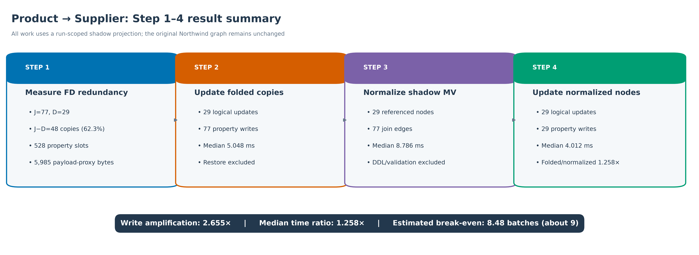
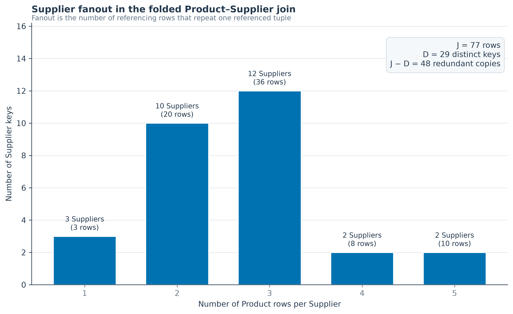
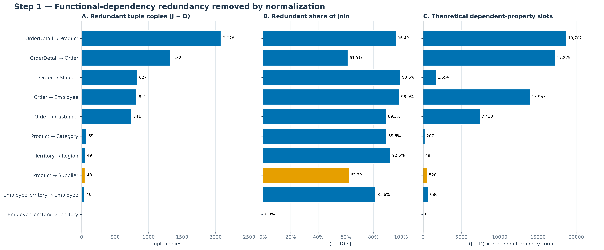
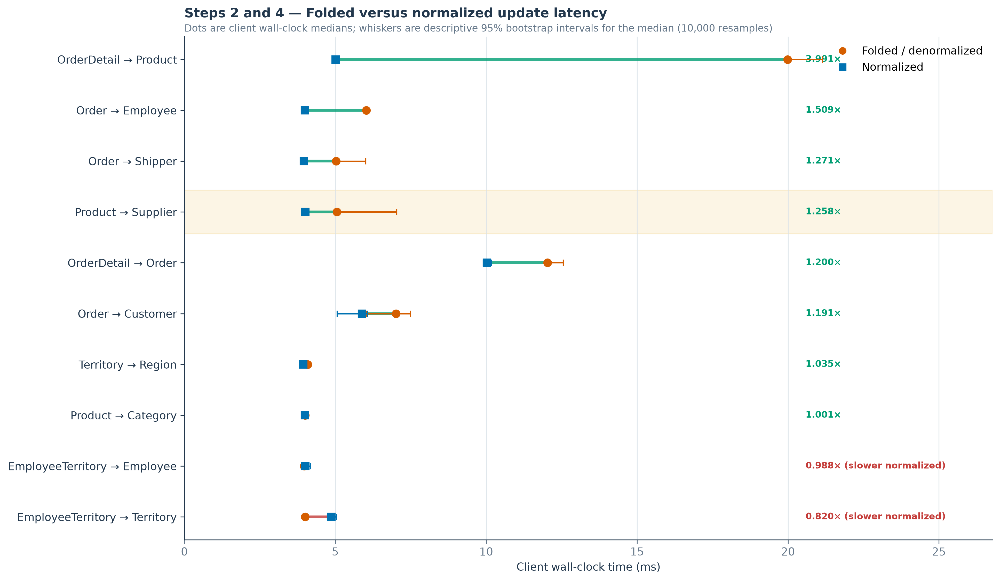
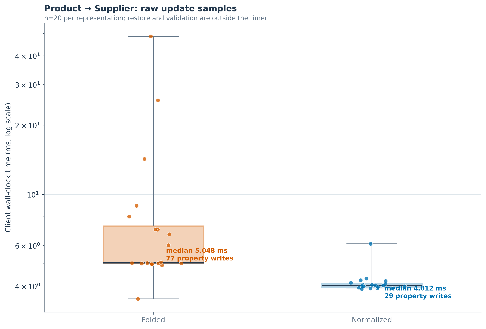
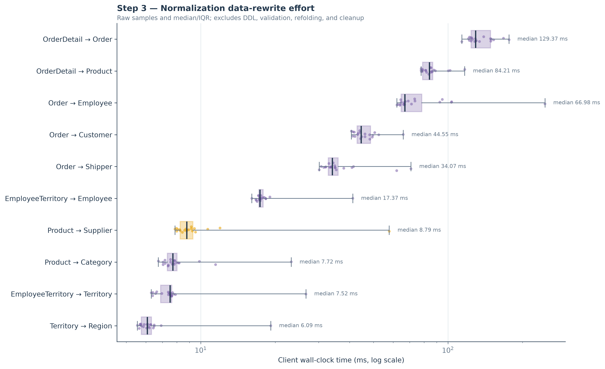
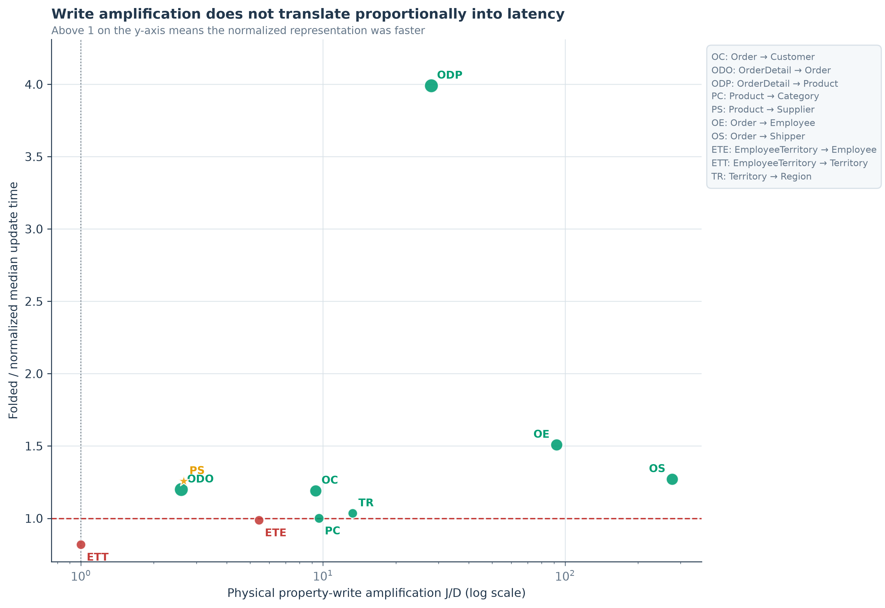
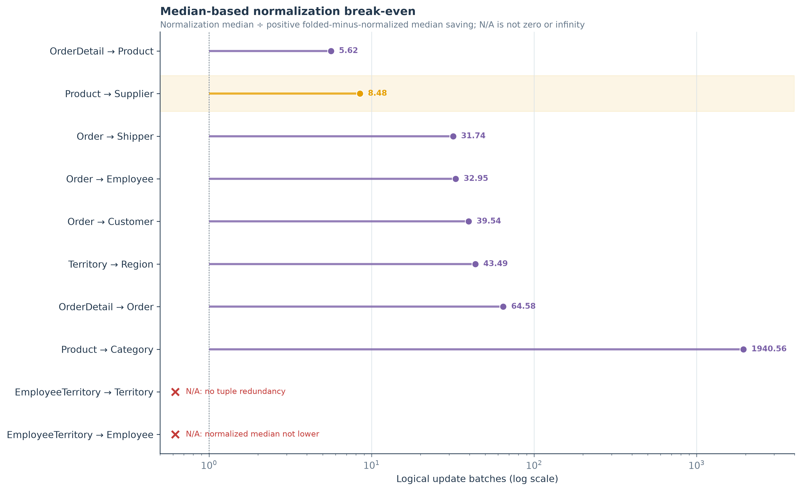

# Northwind 函数依赖规范化实验分析报告

## 摘要

本报告分析 Northwind 中 10 组直接关联表，并以
**Product → Supplier** 作为 Step 1–4 的重点案例，也就是把
Supplier 信息折叠到每个
Product tuple 的情形。所有实验都在带 `run_id` 的
shadow projection 上运行，原始 Northwind 图保持只读；每个 case
开始前、运行中和清理后的原图 SHA-256 完全相同。

Product → Supplier 折叠连接有 \(J=77\) 个
Product
tuple 和 \(D=29\) 个不同且参与
join 的 Supplier key。因此规范化可以消除
**\(J-D=48\) 个 Supplier
tuple 副本，占 J 的
62.338%**。进一步计算得到
**528 个理论冗余 dependent-property
slots**、**432 个冗余非 NULL 值**
和 **5,985 bytes 的冗余 value-payload
proxy**。

更新 `Supplier.Phone` 时，folded
表示写入 77 个属性副本，normalized 表示只写
29 个不同 Supplier 节点，写放大为
**2.655×**。client wall-clock median 分别为
**5.048 ms** 和
**4.012 ms**，时间比为
**1.258×**。Step 3 的 normalization median
为 **8.786 ms**，按中位数估算的
break-even 为 **8.48 个 batch，按完整批次约为第 9 个 batch**。

## 1. 研究问题

- **RQ1：**函数依赖造成多少冗余，规范化能够节省多少？
- **RQ2：**把 folded MV 分解成规范化 MV 的一次性代价是多少？
- **RQ3：**同一组逻辑更新在 folded 和 normalized 表示上分别需要
  多少物理写入与时间？
- **RQ4：**需要多少个同类更新 batch 才能通过更新收益收回
  normalization 成本？

## 2. 实验方法

### Step 0：创建 folded baseline（不计时）

程序为每个 join tuple 创建一个 run-scoped MV node，将 referencing
table 属性和 referenced table 的非 key 属性复制到这个节点，并按
complete topology 复制必要的 boundary relationships。这个 baseline
才是报告中的 “denormalized/original representation”；真实原图从未
被删除或修改。

### Step 1：冗余计算

设 \(J\) 为 folded join tuple 数量，\(D\) 为参与 join 的不同
referenced key 数量：

\[
R_{tuple}=J-D
\]

referenced table 有 \(c_B\) 个列、key 长度为 \(k_B\) 时：

\[
R_{slot}=(J-D)(c_B-k_B)
\]

theoretical slot 包括 NULL 位置；non-NULL 指标只统计实际存在的重复
属性值。payload 指标对字符串计算 UTF-8 bytes，对其他值计算
`str(value)` 的 UTF-8 bytes。它只是**值内容大小 proxy，不是 Neo4j
实际磁盘占用**。topology relationship redundancy 是关系层的独立
指标，不能与属性数量直接相加。

### Step 2 与 Step 4：相同逻辑更新

每个 case 从 referenced table 选择一个非 key 属性，在完整 referenced
relation 的 active domain 上做确定性的 value rotation。两个表示使用
完全相同的 key-to-value 映射：

- Step 2 在 folded MV 中更新全部 \(J\) 个重复位置；
- Step 4 在 normalized MV 中更新 \(D\) 个不同 referenced nodes。

一个 measured run 是一个 autocommit batch，计时持续到结果消费和
commit 完成；restore 与 validation 不计时。每阶段有
20 次 measured runs，主要报告 client wall-clock
median。

### Step 3：Normalization

程序从 folded nodes 中重新创建 normalized referencing nodes；按
referenced key 做 DISTINCT 后创建 referenced nodes；补充显式 join
relationships；并迁移、去重 boundary relationships。计时包括显式
transaction、data decomposition 和 commit，不包含 DDL、validation、
refolding 与 cleanup。

## 3. 实验结果

### 3.1 RQ1：冗余节省

本案例 \(J-D=77-
29=48\)。
Supplier 有 11 个
dependent properties，
因而理论冗余 slots 为
\(48\times
11=528\)。

Supplier fanout histogram 是
`{1: 3, 2: 10, 3: 12, 4: 2, 5: 2}`。fanout 为 \(f\) 的
Supplier 会贡献 \(f-1\) 个冗余 tuple 副本。

| 表对 | 理论冗余属性槽 | 冗余非 NULL 值 | 冗余 payload proxy（bytes） | 冗余 topology relationships |
|---|---:|---:|---:|---:|
| Order → Customer | 7,410 | 6,712 (89.24%) | 79,542 (89.12%) | 0 |
| OrderDetail → Order | 17,225 | 16,345 (61.48%) | 181,246 (61.31%) | 3,975 |
| OrderDetail → Product | 18,702 | 18,702 (96.43%) | 99,116 (96.42%) | 4,156 |
| Product → Category | 207 | 207 (89.61%) | 20,530 (89.67%) | 0 |
| Product → Supplier | 528 | 432 (62.52%) | 5,985 (63.19%) | 0 |
| Order → Employee | 13,957 | 13,642 (98.93%) | 529,822 (98.92%) | 3,911 |
| Order → Shipper | 1,654 | 1,654 (99.64%) | 23,664 (99.64%) | 0 |
| EmployeeTerritory → Employee | 680 | 649 (81.43%) | 25,941 (81.78%) | 3,130 |
| EmployeeTerritory → Territory | 0 | 0 (0.00%) | 0 (0.00%) | 0 |
| Territory → Region | 49 | 49 (92.45%) | 2,156 (93.17%) | 0 |

Product → Supplier 的 topology relationship redundancy 为
0，folded 与 normalized 都有
2,232 条 boundary relationships。
关系冗余为 0 不表示属性冗余为 0；二者衡量的是不同资源。

### 3.2 RQ3：更新成本

本案例一个 batch 有 29 个逻辑
Supplier updates。
folded 结构更新 77 个属性位置，normalized 结构
更新 29 个节点，因此：

\[
A_{write}=J/D=2.655
\]

folded median 为 5.048 ms，
normalized median 为 4.012 ms。
folded median 高 25.825%；从 folded
baseline 看，normalization 将 median 降低
20.524%。

folded focus samples 的 mean=9.282 ms、
median=5.048 ms、max=
48.554 ms。明显的慢样本会拉高 mean，所以
本报告以 median、IQR 和原始点为主，不使用 mean bar 作为核心证据。

### 3.3 RQ2：Normalization 代价

77 个 folded nodes 被分解为
77 个 normalized
Product nodes、
29 个不同 Supplier
nodes，并创建
77 条 join relationships。
normalization median 为 8.786 ms。

所以 \(J-D\) 表示移除了多少份 **referenced 属性副本**，不能解释为
图中物理节点净减少 \(J-D\) 个。规范化会增加 distinct referenced
nodes 与显式 join edges。

### 3.4 写放大与时间比

\(J/D\) 决定物理写入数量，但 elapsed time 还包含 transaction 启动、
查询执行、index/cache、结果消费和 commit 等固定或波动成本，所以
写放大不会等比例转化为时间放大。

### 3.5 RQ4：Break-even

只有 \(J-D>0\) 且 folded median 严格大于 normalized median 时，
才定义：

\[
N_{break-even}=
\frac{T_{normalization,median}}
{T_{folded-update,median}-
  T_{normalized-update,median}}
\]

Product → Supplier 为 8.786/(5.048-4.012)=8.480，因此按完整 batch 约第 9 个回本。

EmployeeTerritory → Employee 虽有冗余，但 normalized median 略慢；
EmployeeTerritory → Territory 为 \(J=D=49\)，没有 tuple 冗余。这两组
break-even 都是未定义，不是 0 或无穷大。Product → Category 的
估算值约 1,940.6，但 median 差只有 0.004 ms，属于微基准噪声量级，
不宜当作精确预测。

## 4. 完整结果

| 表对 | J | D | J−D | Tuple 冗余 | Folded update median (ms) | Normalized update median (ms) | 时间比 | Normalization median (ms) | Break-even batches |
|---|---:|---:|---:|---:|---:|---:|---:|---:|---:|
| Order → Customer | 830 | 89 | 741 | 89.28% | 7.011 | 5.884 | 1.191× | 44.552 | 39.54 |
| OrderDetail → Order | 2,155 | 830 | 1,325 | 61.48% | 12.026 | 10.023 | 1.200× | 129.365 | 64.58 |
| OrderDetail → Product | 2,155 | 77 | 2,078 | 96.43% | 19.981 | 5.006 | 3.991× | 84.209 | 5.62 |
| Product → Category | 77 | 8 | 69 | 89.61% | 3.998 | 3.994 | 1.001× | 7.721 | 1940.56 |
| Product → Supplier | 77 | 29 | 48 | 62.34% | 5.048 | 4.012 | 1.258× | 8.786 | 8.48 |
| Order → Employee | 830 | 9 | 821 | 98.92% | 6.024 | 3.991 | 1.509× | 66.982 | 32.95 |
| Order → Shipper | 830 | 3 | 827 | 99.64% | 5.029 | 3.955 | 1.271× | 34.066 | 31.74 |
| EmployeeTerritory → Employee | 49 | 9 | 40 | 81.63% | 3.964 | 4.012 | 0.988× | 17.370 | N/A |
| EmployeeTerritory → Territory | 49 | 49 | 0 | 0.00% | 3.996 | 4.876 | 0.820× | 7.521 | N/A |
| Territory → Region | 53 | 4 | 49 | 92.45% | 4.083 | 3.943 | 1.035× | 6.087 | 43.49 |

10 组 case 中有
9 组存在 tuple redundancy，
8 组的 normalized median 更低。
最强运行时结果是 OrderDetail → Product，folded/normalized median
ratio=3.991×，估算 break-even=
5.62 batches。

十组独立 workload 的描述性加总是 J=7,105、
D=1,107、J−D=
5,998，weighted tuple redundancy=
84.419%。这些 case 会共享/重叠原始表，
因此该加总**不等于**同时物化全部十组 MV 后的数据库净节省。

## 5. 讨论

1. 当 J>D 时，规范化确实消除了函数依赖导致的值重复；tuple、slot、
   non-NULL、payload 从不同粒度描述这种冗余。
2. 更少的物理写入不保证按比例减少 wall-clock time。8/10 case 的
   normalized median 更低，但固定开销会主导一些小 workload。
3. OrderDetail → Product 是最强的更新性能证据：
   3.991× time ratio，按中位数约
   6 个 batch 回本。
4. “original graph update” 应准确表述为 folded/denormalized shadow
   update；真实 source graph 在整个实验中保持不变。

## 6. 有效性限制

- 数据来自一个本地 warm-cache suite（`Neo4j/2026.06.0; Python 3.13.14; Neo4j driver 6.2.0`），
  没有清空 server page/query cache，也没有随机交错不同 phase。
- 20 个 timings 是同一数据库上的重复 transactions，不是 20 个独立
  数据库部署；bootstrap interval 只描述当前样本序列的 resampling
  variability，不作为总体显著性推断。
- 不同 case 更新的属性、类型、active-domain size、batch size 和
  topology 不同。跨 case 绝对毫秒只能作为描述性背景；case 内
  folded 与 normalized 才是受控比较。
- update restore/validation 不计时；normalization 不包含 DDL、
  validation、refolding、cleanup。break-even 继承这些计时边界，
  不是完整生产迁移成本预测。
- payload proxy 不包含 Neo4j record header、dynamic store、index、
  label、relationship、transaction log、compression 和 page layout。
  实际磁盘空间需要另做 store-level 实验。
- 本实验未测读查询、并发、锁与长期运行影响。

## 7. 结论

Product → Supplier 案例直接回答了最初的三项任务：

- **规范化节省的冗余：**48 个
  Supplier tuple copies、
  528 个理论 dependent-property slots、
  432 个冗余非 NULL 值和
  5,985 bytes value-payload proxy；
- **规范化时间：**定义的数据重写范围 median=
  8.786 ms；
- **更新差异：**77 对
  29 次属性写入，folded median=
  5.048 ms，normalized median=
  4.012 ms，folded/normalized=
  1.258×。

按本次 median 估算，break-even 为 8.48 个 batch，按完整批次约为第 9 个 batch。全套实验同时
表明：FD/write redundancy
很高时可能得到清晰更新收益，但小 workload 必须结合原始样本、
outlier 与固定开销谨慎解释。

## 附录：可复现性

- 输入文件：`northwind_fd_experiment_results.json`
- 输入 SHA-256：`2d88fdf3d14d34f576c1ea26b67e19f9dfb290c814a430ffa8e74be6a4adc031`
- Report schema：v6
- Join fingerprint schema：v2
- Database：`northwind`
- Topology mode：`complete`
- 所有 case 的原图指纹在实验前、中、后相同
- 所有 shadow graph 与临时 schema 均在 case 结束后清理

`case_summary.csv`、`timing_samples.csv` 和
`analysis_summary.json` 保存了报告与图表使用的底层数据；每张图同时
输出 300 dpi PNG 和可缩放 SVG。
